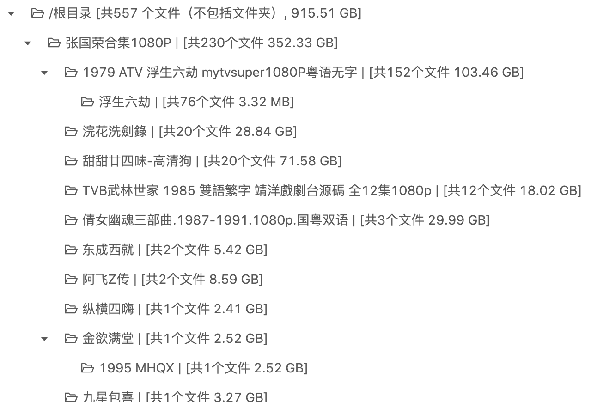
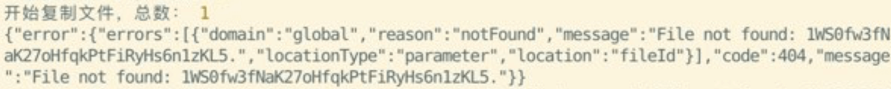

## 更新日志
> 更新方法：在 gd-utils 目录下，执行 `git pull` 拉取最新代码，如果你使用了 pm2 守护进程，执行`pm2 reload server`刷新生效。

### [2020-08-02] 关于“没有可用的SA”报错信息
- 最近Google Drive的 API 似乎有点抽风，转存新分享的资源时经常随机遇到`userRateLimitExceeded`（一般这种错误只会在SA用完每日转存流量750G时触发）的接口返回错误导致SA被剔除（即使是新加的SA也会遇到），而对于比较老的分享或者自己团队盘文件对拷则没问题。  
不得已我只好修改了一下程序的逻辑，只有当SA连续两次遇到`userRateLimitExceeded`的错误时才会被剔除，在这种条件下，据我的观察，拷贝一个新分享的资源时，平均每转存100个文件会被剔除掉一个SA。  
如果你不希望因为接口返回`userRateLimitExceeded`而剔除掉对应的SA，可以手动修改代码，方法见：https://github.com/iwestlin/gd-utils/issues/138#issuecomment-666156273
- 命令行添加 `--dncf` 参数，表示`do not copy folders`，即转存资源时不复制任何递归子目录，直接将所有文件拷贝到新生成的文件夹中。

[2020-07-28]  
- 添加 [aria2.js](https://github.com/iwestlin/gd-utils/blob/master/aria2.js) 脚本，方便利用 `aria2c` 下载google drive目录，使用帮助可执行 `./aria2.js -h` 查看。

相关 issue: [https://github.com/iwestlin/gd-utils/issues/133](https://github.com/iwestlin/gd-utils/issues/133)  
使用录屏：[https://drive.google.com/file/d/1lzN7R9Klw66C5UttUUDN3_EsN3pNs62q/view](https://drive.google.com/file/d/1lzN7R9Klw66C5UttUUDN3_EsN3pNs62q/view)

[2020-07-21]  
- 添加数据库clear脚本，只需在`gd-utils`目录下执行`node clear-db.js`就可以删除所有获取的文件信息（但会保留拷贝记录和bookmark）同时减小数据库文件大小了
- 调整提取分享链接的方法，基本能够识别所有类型消息中的分享ID

[2020-07-17]  
- 给命令行 `./dedupe` 添加 `--yes` （简写`-y`）选项，表示“若发现重复项，不询问直接删除”
- 给 `./copy` `./count` `./dedupe` 添加 `--sa` 选项，可指定sa目录位置  
示例用法 `./count folderID -S --sa test`，表示读取 `./test` 目录下的sa json文件（而不是默认的./sa目录）

[2020-07-15]  
- 给tg机器人添加「强制刷新」和「清除按钮」按钮。  
点击「强制刷新」可以无视本地缓存强制从线上获取对应链接的文件信息，省去手动输入 `/count folderID -u` 的麻烦  
点击「清除按钮」可以清除链接消息下的多个按钮，适合任务完成后清除，防止误触

[2020-07-11]  
- 给tg机器人添加单文件链接（`https://drive.google.com/file/d/1gfR...`）转存功能

[2020-07-10]  
- 添加树形导出类型，示例用法： `./count folder-id -S -t tree -o tree.html`

[tree.html](https://gdurl.viegg.com/api/gdrive/count?fid=1A35MT6auEHASo3egpZ3VINMOwvA47cJG&type=tree)可直接用浏览器打开：

前端源码：[https://github.com/iwestlin/foldertree/blob/master/app.jsx](https://github.com/iwestlin/foldertree/blob/master/app.jsx)

[2020-07-08]
- 添加[colab脚本](https://github.com/iwestlin/gd-utils/issues/50#issuecomment-655298073)

[2020-07-07]
- 在复制文件时不使用p-limit依赖，改为while循环控制并行请求数，从而大大减少复制十万及以上数量级文件时的内存占用，避免进程被node强行退出。
- 给机器人添加更多 /task 功能，支持清除所有已完成任务、删除特定任务

[2020-07-06]  
- 给机器人添加收藏功能，[使用示例](https://drive.google.com/drive/folders/1sW8blrDT8o7882VOpXXr3pzXR73d4yGX)

[2020-07-05]  
- pm2 启动脚本换成 `pm2 start server.js --node-args="--max-old-space-size=4096"`，避免任务文件数超大时内存占用太高被node干掉。

[2020-07-04]**【重要更新】**  
- 解决了长时间拷贝命令突然出现 `Invalid Credentials` 错误的问题。
原因是依赖的[gtoken](https://www.npmjs.com/package/gtoken)在过期时间后并不返回新的access_token...之前有不少朋友遇到过，一开始我还以为是sa同时使用太多触发了Google限制，直到我自己将sa分批使用量降到了50却也依然遇到了这种报错……
- 提升了拷贝大量文件时数据库的操作效率，大大减少了cpu占用。(由于更改了数据库的结构，所以如果有未完成的任务，请先跑完任务再更新。如果更新代码后再继续之前未完成的任务，会导致无法接上进度。)
- 如果触发团队盘40万文件数限制，会返回明确的错误消息，而不是之前的 `创建目录失败，请检查您的账号是否有相关权限`
- 如果创建目录未完成被中断，相同命令重新开始执行后，会保留原始目录的结构继续创建目录。（之前会导致结构被打乱）

[2020-07-03]  
- 给命令行 ./copy 命令添加了 `-D` 选项，表示不在目的地创建同名文件夹，直接将源文件夹中的文件原样复制到目的文件夹中

[2020-07-02]  
- 机器人 /task 命令返回的进度信息每 10 秒更新一次
- `./dedupe` 改为将重复文件移动到回收站（需要内容管理者及以上权限）
- 给 sqlite 打开 WAL 模式提升效率
- 提前5分钟将access_token判定为过期，减少未授权错误

[2020-07-01]（建议所有使用tg机器人的用户更新）  
- 给机器人的 `/count` 和 `/copy` 命令添加了 `-u` 参数的支持，命令最后加上 -u 表示强制从线上获取源文件夹信息
- 允许继续状态为已完成的任务（适合搭配 -u 参数，增量复制刚分享出来的未更新完毕的文件夹）
- 支持识别转发的 [@gdurl](https://t.me/s/gdurl) 频道消息中的google drive链接
- 机器人回复任务完成消息时，携带 `成功拷贝目录（文件）数/总目录（文件）数`
- 机器人回复统计消息时，携带文件夹名称
- 机器人回复`/task`消息时，携带源文件夹名称链接和新文件夹链接
- 当统计表格太长导致机器人发送消息失败时，发送统计概要
- 增加了 [专家设置](#专家设置) 一节，保障HTTPS接口安全

[2020-06-30]  
- 命令行操作时，不换行输出进度信息，同时将进度信息输出间隔调整为1秒
- 隐藏 timeout exceed 报错信息

## 重要更新（2020-06-29）
如果你遇到了以下几种问题，请务必阅读此节：

- 任务异常中断
- 命令行日志无限循环输出但进度不变
- 复制完发现丢文件

有不少网友遇到这些问题，但是作者一直无法复现，直到有tg网友发了张运行日志截图：

报错日志的意思是找不到对应的目录ID，这种情况会发生在SA没有对应目录的阅读权限的时候。
当进行server side copy时，需要向Google的服务器提交要复制的文件ID，和复制的位置，也就是新创建的目录ID，由于在请求时是随机选取的SA，所以当选中没有权限的SA时，这次拷贝请求没有对应目录的权限，就会发生图中的错误。

**所以，上述这些问题的源头是，sa目录下，混杂了没有权限的json文件！**

以下是解决办法：
- 在项目目录下，执行 `git pull` 拉取最新代码
- 执行 `./validate-sa.js -h` 查看使用说明
- 选择一个你的sa拥有阅读权限的目录ID，执行 `./validate-sa.js 你的目录ID`

程序会读取sa目录下所有json文件，依次检查它们是否拥有对 `你的目录ID` 的阅读权限，如果最后发现了无效的SA，程序会提供选项允许用户将无效的sa json移动到特定目录。

将无效sa文件移动以后，如果你使用了pm2启动，需要 `pm2 reload server` 重启下进程。

操作示例： [https://drive.google.com/drive/folders/1iiTAzWF_v9fo_IxrrMYiRGQ7QuPrnxHf](https://drive.google.com/drive/folders/1iiTAzWF_v9fo_IxrrMYiRGQ7QuPrnxHf)
