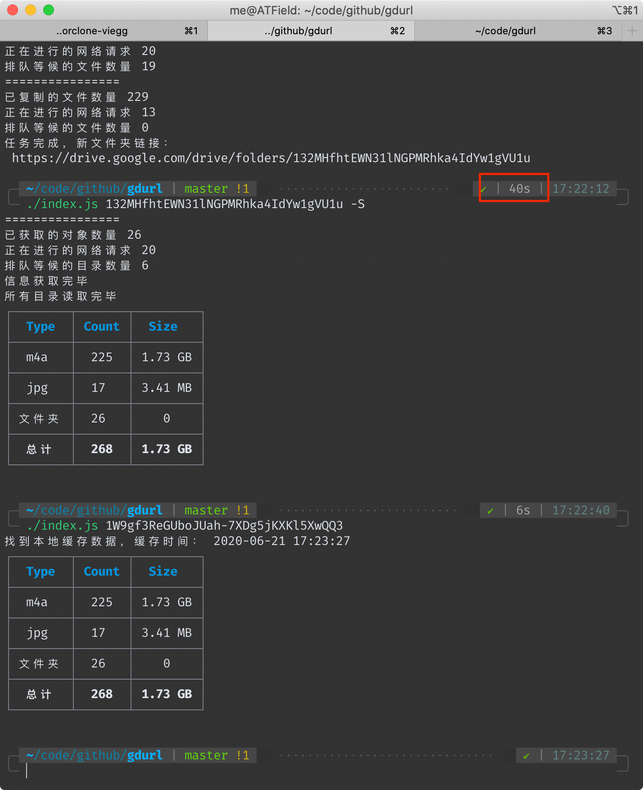
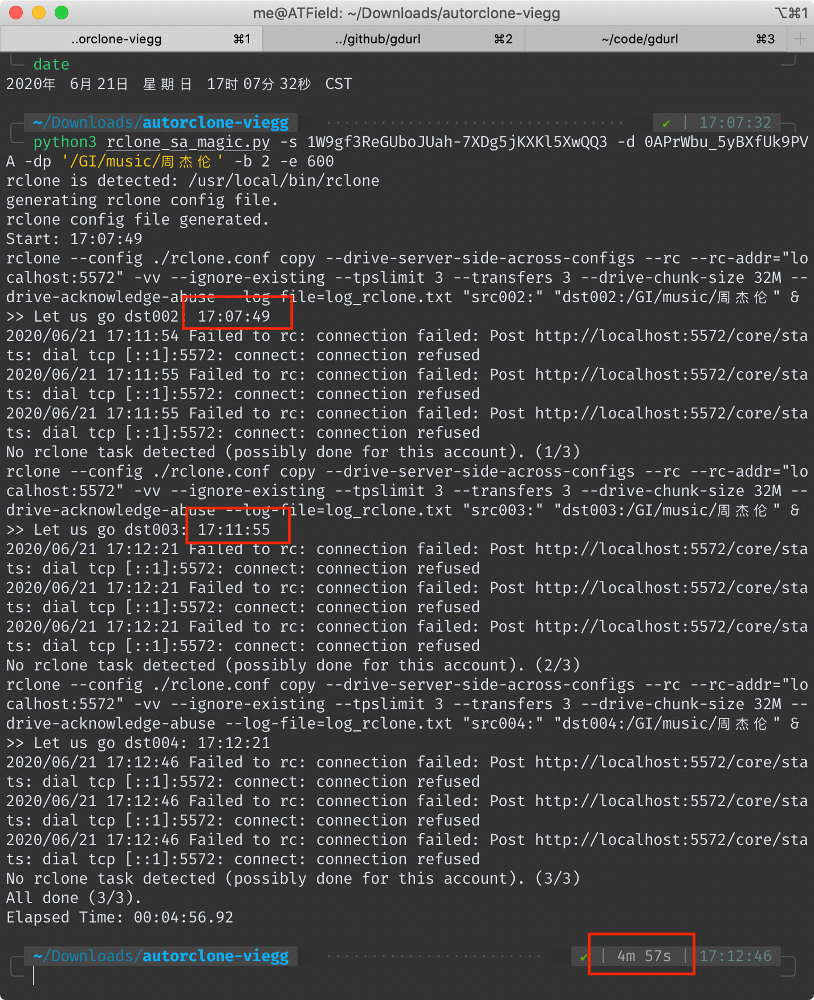
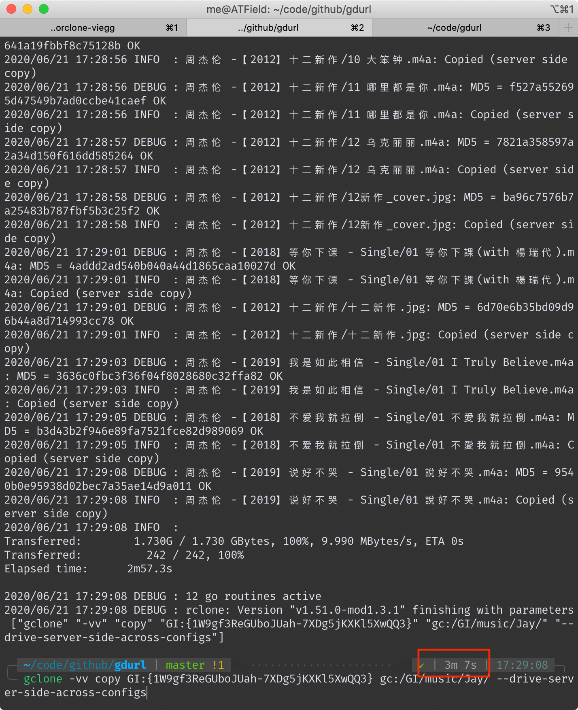
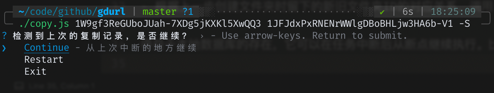

# 对比本工具和其他类似工具在 server side copy 的速度上的差异

以拷贝[https://drive.google.com/drive/folders/1W9gf3ReGUboJUah-7XDg5jKXKl5XwQQ3](https://drive.google.com/drive/folders/1W9gf3ReGUboJUah-7XDg5jKXKl5XwQQ3)为例（[文件统计](https://gdurl.viegg.com/api/gdrive/count?fid=1W9gf3ReGUboJUah-7XDg5jKXKl5XwQQ3)）  
共 242 个文件和 26 个文件夹

如无特殊说明，以下运行环境都是在本地命令行（挂代理）

## 本工具耗时 40 秒
<!--    -->

另外我在一台洛杉矶的vps上执行相同的命令，耗时23秒。
这个速度是在使用本项目默认配置**20个并行请求**得出来的，此值可自行修改（下文有方法），并行请求数越大，总速度越快。

## AutoRclone 耗时 4 分 57 秒（去掉拷贝后验证时间 4 分 6 秒）
<!--  -->

## gclone 耗时 3 分 7 秒
<!--  -->

## 为什么速度会有这么大差异
首先要明确一下 server side copy（后称ssc） 的原理。

对于 Google Drive 本身而言，它不会因为你ssc复制了一份文件而真的去在自己的文件系统上复制一遍（否则不管它有多大硬盘都会被填满），它只是在数据库里添上了一笔记录。

所以，无论ssc一份大文件还是小文件，理论上它的耗时都是一样的。
各位在使用这些工具的时候也可以感受到，复制一堆小文件比复制几个大文件要慢得多。

Google Drive 官方的 API 只提供了复制单个文件的功能，无法直接复制整个文件夹。甚至也无法读取整个文件夹，只能读取某个文件夹的第一层子文件（夹）信息，类似 Linux 命令行里的 `ls` 命令。

这三个工具的ssc功能，本质上都是对[官方file copy api](https://developers.google.com/drive/api/v3/reference/files/copy)的调用。

然后说一下本工具的原理，其大概步骤如下：

- 首先，它会递归读取要复制的目录里的所有文件和文件夹的信息，并保存到本地。
- 然后，将所有文件夹对象过滤出来，再根据彼此的父子关系，创建新的同名文件夹，还原出原始结构。（在保证速度的同时保持原始文件夹结构不变，这真的费了一番功夫）
- 根据上一步创建文件夹时留下的新旧文件夹ID的对应关系，调用官方API复制文件。

得益于本地数据库的存在，它可以在任务中断后从断点继续执行。比如用户按下`ctrl+c`后，可以再执行一遍相同的拷贝命令，本工具会给出三个选项：
<!--  -->

另外两个工具也支持断点续传，它们是怎样做到的呢？AutoRclone是用python对rclone命令的一层封装，gclone是基于rclone的魔改。
对了——值得一提的是——本工具是直接调用的官方API，不依赖于rclone。

我没有仔细阅读过rclone的源码，但是从它的执行日志中可以大概猜出其工作原理。
先补充个背景知识：对于存在于Google drive的所有文件（夹）对象，它们的一生都伴随着一个独一无二的ID，就算一个文件是另一个的拷贝，它们的ID也不一样。

所以rclone是怎么知道哪些文件拷贝过，哪些没有呢？如果它没有像我一样将记录保存在本地数据库的话，那么它只能在同一路径下搜索是否存在同名文件，如果存在，再比对它们的 大小/修改时间/md5值 等判断是否拷贝过。

也就是说，在最坏的情况下（假设它没做缓存），它每拷贝一个文件之前，都要先调用官方API来搜索判断此文件是否已存在！

此外，AutoRclone和gclone虽然都支持自动切换service account，但是它们执行拷贝任务的时候都是单一SA在调用API，这就注定了它们不能把请求频率调太高——否则可能触发限制。

而本工具同样支持自动切换service account，区别在于它的每次请求都是随机选一个SA，我的[文件统计](https://gdurl.viegg.com/api/gdrive/count?fid=1W9gf3ReGUboJUah-7XDg5jKXKl5XwQQ3)接口就用了20个SA的token，同时请求数设置成20个，也就是平均而言，单个SA的并发请求数只有一次。

所以瓶颈不在于SA的频率限制，而在运行的vps或代理上，各位可以根据各自的情况适当调整 PARALLEL_LIMIT 的值（在 `config.js` 里）。

当然，如果某个SA的单日流量超过了750G，会自动切换成别的SA，同时过滤掉流量用尽的SA。当所有SA流量用完后，会报错提示并退出。

*使用SA存在的限制：除了每日流量限制外，其实每个SA还有个**15G的个人盘空间限额**，也就是说你每个SA最多能拷贝15G的文件到个人盘，但是拷贝到团队盘则无此限制。*
