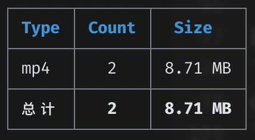

# Google Drive 百宝箱

> 不只是最快的 google drive 拷贝工具 [与其他工具的对比](./compare.md)

## 一键安装脚本(感谢 脚本制作者 [@vitaminx](https://github.com/vitaminx))
> 如果你没有Linux操作经验或者是新开的vps，可尝试使用此脚本

- 首先准备好以下两个条件：
  - 在Telegram上注册好机器人并取得并记录下该机器人TOKEN
  - 一个域名在cloudflare解析到该机器人所在VPS的IP
- 准备好以上两个条件后，复制以下内容粘贴到VPS命令行窗口回车即可
```
bash -c "$(curl -fsSL https://raw.githubusercontent.com/iwestlin/gd-utils/master/gdutilsinstall.sh)"
```
- 安装过程中需要输入一下四个参数：
  - 机器人TOKEN：这个在Telegram里面找“@BotFather”注册即可获得
  - 自己的的Telegram username：在Telegram里面直接查看
  - web服务名：这是个是很重要的识别标志，请设置为你的域名（格式：abc.34513.com）
  - 域名网址全称：你在cloudflare上解析到VPS的域名网址全称（格式：https://abc.34513.com）
- 测试可用完美安装系统：
  - Centos 7/8
  - debian 9/10
  - ubuntu 16.04/18.04/19.10/20.04

## demo
[https://drive.google.com/drive/folders/124pjM5LggSuwI1n40bcD5tQ13wS0M6wg](https://drive.google.com/drive/folders/124pjM5LggSuwI1n40bcD5tQ13wS0M6wg)

## 更新日志
[2020-06-30]

- 命令行操作时，不换行输出进度信息，同时将进度信息输出间隔调整为1秒
- 隐藏 timeout exceed 报错信息

## 重要更新（2020-06-29）
如果你遇到了以下几种问题，请务必阅读此节：

- 任务异常中断
- 命令行日志无限循环输出但进度不变
- 复制完发现丢文件

有不少网友遇到这些问题，但是作者一直无法复现，直到有tg网友发了张运行日志截图：

报错日志的意思是找不到对应的目录ID，这种情况会发生在SA没有对应目录的阅读权限的时候。
当进行server side copy时，需要向Google的服务器提交要复制的文件ID，和复制的位置，也就是新创建的目录ID，由于在请求时是随机选取的SA，所以当选中没有权限的SA时，这次拷贝请求没有对应目录的权限，就会发生图中的错误。

**所以，上述这些问题的源头是，sa目录下，混杂了没有权限的json文件！**

以下是解决办法：
- 在项目目录下，执行 `git pull` 拉取最新代码
- 执行 `./validate-sa.js -h` 查看使用说明
- 选择一个你的sa拥有阅读权限的目录ID，执行 `./validate-sa.js 你的目录ID`

程序会读取sa目录下所有json文件，依次检查它们是否拥有对 `你的目录ID` 的阅读权限，如果最后发现了无效的SA，程序会提供选项允许用户将无效的sa json移动到特定目录。

将无效sa文件移动以后，如果你使用了pm2启动，需要 `pm2 reload server` 重启下进程。

操作示例： [https://drive.google.com/drive/folders/1iiTAzWF_v9fo_IxrrMYiRGQ7QuPrnxHf](https://drive.google.com/drive/folders/1iiTAzWF_v9fo_IxrrMYiRGQ7QuPrnxHf)

## 常见问题
下面是一些网友的踩坑心得，如果你配置的时候也不小心掉进坑里，可以进去找找有没有解决办法：

- [ikarosone 基于宝塔的搭建过程](https://www.ikarosone.top/archives/195.html)

- [@greathappyforest 踩的坑](doc/tgbot-appache2-note.md)

在命令行操作时如果输出 `timeout exceed` 这样的消息，是正常情况，不会影响最终结果，因为程序对每个请求都有7次重试的机制。
如果timeout的消息比较多，可以考虑降低并行请求数，下文有具体方法。

复制结束后，如果最后输出的消息里有 `未读取完毕的目录ID`，只需要在命令行执行上次同样的拷贝命令，选continue即可继续。

如果你成功复制完以后，统计新的文件夹链接发现文件数比源文件夹少，说明Google正在更新数据库，请给它一点时间。。一般等半小时再统计数据会比较完整。

如果你使用tg操作时，发送拷贝命令以后，/task 进度始终未开始（在复制文件数超多的文件夹时常会发生），是正常现象。
这是因为程序正在获取源文件夹的所有文件信息。它的运行机制严格按照以下顺序：
```
1、获取源文件夹所有文件信息
2、根据源文件夹的目录结构，在目标文件夹创建目录
3、所有目录创建完成后，开始复制文件
```

**如果源文件夹的文件数非常多（一百万以上），请一定在命令行进行操作**，因为程序运行的时候会把文件信息保存在内存中，文件数太多的话容易内存占用太多被nodejs干掉。可以像这样执行命令：
```
 node --max-old-space-size=4096 count folder-id -S
 ```
这样进程就能最大占用4G内存了。


## 搭建过程
[https://drive.google.com/drive/folders/1Lu7Cwh9lIJkfqYDIaJrFpzi8Lgdxr4zT](https://drive.google.com/drive/folders/1Lu7Cwh9lIJkfqYDIaJrFpzi8Lgdxr4zT)

需要注意的地方：

- 视频中省略了一个比较重要的步骤就是**从本地上传service account授权文件到 sa 目录下**，tg机器人的所有操作都是通过sa授权的，所以你们别忘了。。
- 视频中**nginx的配置里，server_name就是你的二级域名，需要和cloudflare的设置一样**的（mybbbottt），我分开录的视频所以没做到一致。
- 还有省略的步骤就是注册域名和把域名托管到cloudflare了，这一步网上太多资料了，甚至也有免费注册（一年）域名的地方（ https://www.freenom.com/ ），具体教程大家搜搜看吧。

## 功能简介
本工具目前支持以下功能：
- 统计任意（您拥有相关权限的，下同，不再赘述）目录的文件信息，且支持以各种形式（html, table, json）导出。
支持中断恢复，且统计过的目录（包括其所有子孙目录）信息会记录在本地数据库文件中（gdurl.sqlite）
请在本项目目录下命令行输入 `./count -h` 查看使用帮助

- 拷贝任意目录所有文件到您指定目录，同样支持中断恢复。
支持根据文件大小过滤，可输入 `./copy -h` 查看使用帮助

- 对任意目录进行去重，删除同一目录下的md5值相同的文件（只保留一个），删除空目录。
命令行输入 `./dedupe -h` 查看使用帮助

- 在 config.js 里完成相关配置后，可以将本项目部署在（可正常访问谷歌服务的）服务器上，提供 http api 文件统计接口

- 支持 telegram bot，配置完成后，上述功能均可通过 bot 进行操作

## 环境配置
本工具需要安装nodejs，客户端安装请访问[https://nodejs.org/zh-cn/download/](https://nodejs.org/zh-cn/download/)，服务器安装可参考[https://github.com/nodesource/distributions/blob/master/README.md#debinstall](https://github.com/nodesource/distributions/blob/master/README.md#debinstall)

建议选择v12版本的node，以防接下来安装依赖出错。

如果你的网络环境无法正常访问谷歌服务，需要先在命令行进行一些配置：（如果可以正常访问则跳过此节）
```
http_proxy="YOUR_PROXY_URL" && https_proxy=$http_proxy && HTTP_PROXY=$http_proxy && HTTPS_PROXY=$http_proxy
```
请把`YOUR_PROXY_URL`替换成你自己的代理地址

## 依赖安装
- 命令行执行`git clone https://github.com/iwestlin/gd-utils && cd gd-utils` 克隆并切换到本项目文件夹下
- **执行 `npm install --unsafe-perm=true --allow-root` 安装依赖**，部分依赖可能需要代理环境才能下载，所以需要上一步的配置

如果在安装过程中发生报错，请切换nodejs版本到v12再试。如果报错信息里有`Error: not found: make`之类的消息，说明你的命令行环境缺少make命令，可参考[这里](https://askubuntu.com/questions/192645/make-command-not-found)或直接google搜索`Make Command Not Found`

如果报错信息里有 `better-sqlite3`，先执行 `npm config set unsafe-perm=true`
然后 `rm -rf node_module` 删掉依赖目录，最后再执行下`npm i`安装试试。

依赖安装完成后，项目文件夹下会多出个`node_modules`目录，请不要删除它，接下来进行下一步配置。

## Service Account 配置
强烈建议使用service account（后称SA）, 获取方法请参见 [https://gsuitems.com/index.php/archives/13/](https://gsuitems.com/index.php/archives/13/#%E6%AD%A5%E9%AA%A42%E7%94%9F%E6%88%90serviceaccounts)
获取到 SA 的 json 文件后，请将其拷贝到 `sa` 目录下

配置好 SA 以后，如果你不需要对个人盘下的文件进行操作，可跳过[个人帐号配置]这节，而且执行命令的时候，记得带上 `-S` 参数告诉程序使用SA授权进行操作。

## 个人帐号配置
- 命令行执行 `rclone config file` 找到 rclone 的配置文件路径
- 打开这个配置文件 `rclone.conf`, 找到 `client_id`, `client_secret` 和 `refresh_token` 这三个变量，将其分别填入本项目下的 `config.js` 中，需要注意这三个值必须被成对的英文引号包裹，且引号后以英文逗号结尾，也就是需要符合JavaScript的[对象语法](https://developer.mozilla.org/zh-CN/docs/Web/JavaScript/Reference/Operators/Object_initializer)

如果你没有配置过rclone，可以搜索`rclone google drive 教程`完成相关配置。

如果你的`rclone.conf`里没有`client_id`和`client_secret`，说明你配置rclone的时候默认用了rclone自己的client_id，连rclone自己[都不建议这样做](https://github.com/rclone/rclone/blob/8d55367a6a2f47a1be7e360a872bd7e56f4353df/docs/content/drive.md#making-your-own-client_id)，因为大家共享了它的接口调用限额，在使用高峰期可能会触发限制。

获取自己的clinet_id可以参见这两篇文章：[Cloudbox/wiki/Google-Drive-API-Client-ID-and-Client-Secret](https://github.com/Cloudbox/Cloudbox/wiki/Google-Drive-API-Client-ID-and-Client-Secret) 和 [https://p3terx.com/archives/goindex-google-drive-directory-index.html#toc_2](https://p3terx.com/archives/goindex-google-drive-directory-index.html#toc_2)

获取到client_id和client_secret后，再次执行一遍`rclone config`，创建一个新的remote，**在配置过程中一定要填入你新获取的clinet_id和client_secret**，就能在`rclone.conf`里看到新获取的`refresh_token`了。**注意，不能使用之前的refrest_token**，因为它对应的是rclone自带的client_id

参数配置好以后，在命令行执行 `node check.js`，如果命令返回了你的谷歌硬盘根目录的数据，说明配置成功，可以开始使用本工具了。

## Bot配置
如果要使用 telegram bot 功能，需要进一步配置。

首先在 [https://core.telegram.org/bots#6-botfather](https://core.telegram.org/bots#6-botfather) 根据指示拿到 bot 的 token，然后填入 config.js 中的 `tg_token` 变量。

然后获取自己的 telegram username，这个username不是显示的名称，而是tg个人网址后面的那串字符，比如，我的tg个人网址是 `https://t.me/viegg` ，用户名就是 `viegg`，获取用户名的目的是在代码里配置白名单，只允许特定的用户调用机器人。将username填入 `config.js`里的配置，像这样：
`tg_whitelist: ['viegg']`，就代表只允许我自己使用这个机器人了。

如果想把机器人的使用权限分享给别的用户，只需要改成这样子： `tg_whitelist: ['viegg', '其他人的username']`

接下来需要将代码部署到服务器上。
如果你一开始就是在服务器上配置的，可以直接执行`npm i pm2 -g`

如果你之前是在本地操作的，请在服务器上同样重复一遍，配置好相关参数后，执行`npm i pm2 -g`安装进程守护程序pm2

安装好pm2之后，执行 `pm2 start server.js`，代码运行后会在服务器上监听`23333`端口。

如果你启动程序后想看运行日志，执行 `pm2 logs`

查看 pm2 守护的进程列表，执行 `pm2 l`

停止运行中的进程，执行 `pm2 stop 对应的进程名称`

**如果你修改了代码中的配置，需要 `pm2 reload server` 才能生效**。

> 如果你不想用nginx，可以将`server.js`中的`23333`改成`80`直接监听80端口（可能需要root权限）

接下来可通过nginx或其他工具起一个web服务，示例nginx配置：
```
server {
  listen 80;
  server_name your.server.name;

  location / {
    proxy_set_header Host $host;
    proxy_set_header X-Real-IP $remote_addr;
    proxy_set_header X-Forwarded-For $proxy_add_x_forwarded_for;
    proxy_pass http://127.0.0.1:23333/;
  }
}
```
配置好nginx后，可以再套一层cloudflare，具体教程请自行搜索。

检查网站是否部署成功，可以命令行执行（请将YOUR_WEBSITE_URL替换成你的网址）
```
curl 'YOUR_WEBSITE_URL/api/gdurl/count?fid=124pjM5LggSuwI1n40bcD5tQ13wS0M6wg'
```


如果返回了这样的文件统计，说明部署成功了。

最后，在命令行执行（请将[YOUR_WEBSITE]和[YOUR_BOT_TOKEN]分别替换成你自己的网址和bot token）
```
curl -F "url=[YOUR_WEBSITE]/api/gdurl/tgbot" 'https://api.telegram.org/bot[YOUR_BOT_TOKEN]/setWebhook'
```
这样，就将你的服务器连接上你的 telegram bot 了，试着给bot发送个 `/help`，如果它回复给你使用说明，那就配置成功了。

## 补充说明
在`config.js`文件里，还有另外的几个参数：
```
// 单次请求多少毫秒未响应以后超时（基准值，若连续超时则下次调整为上次的2倍）
const TIMEOUT_BASE = 7000

// 最大超时设置，比如某次请求，第一次7s超时，第二次14s，第三次28s，第四次56s，第五次不是112s而是60s，后续同理
const TIMEOUT_MAX = 60000

const LOG_DELAY = 5000 // 日志输出时间间隔，单位毫秒
const PAGE_SIZE = 1000 // 每次网络请求读取目录下的文件数，数值越大，越有可能超时，不得超过1000

const RETRY_LIMIT = 7 // 如果某次请求失败，允许其重试的最大次数
const PARALLEL_LIMIT = 20 // 网络请求的并行数量，可根据网络环境调整

const DEFAULT_TARGET = '' // 必填，拷贝默认目的地ID，如果不指定target，则会拷贝到此处，建议填写团队盘ID，注意要用英文引号包裹
```
读者可根据各自情况进行调整

## 注意事项
程序的原理是调用了[google drive官方接口](https://developers.google.com/drive/api/v3/reference/files/list)，递归获取目标文件夹下所有文件及其子文件夹信息，粗略来讲，某个目录下包含多少个文件夹，就至少需要这么多次请求才能统计完成。

目前尚不知道google是否会对接口做频率限制，也不知道会不会影响google账号本身的安全。

**请勿滥用，后果自负**
