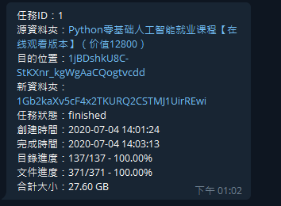
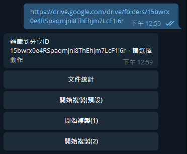
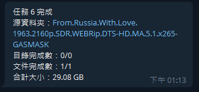

# gd-utils-cht

> 不只是最快的 google drive 拷贝工具 [与其他工具的对比](./compare.md)

> 我就只寫我修改過的部分吧 具體說明還是看[這邊](https://github.com/iwestlin/gd-utils)和[這邊](https://github.com/vitaminx/gd-utils)吧
## tg_bot 修改部分
- 執行/task命令時, 會回傳完成度百分比
  
  
- 貼上分享連結時, 新增更多可用的常用選項, 不用每次都另外輸入dst ID
  - 這邊預設三個複製目的地都相同, 皆為`config.js`中的`DEFAULT_TARGET`
  - 修改處在[`router.js`](router.js)的Line 68. Line 73, 給target賦值上對應的dst ID就行了
  
- 複製完成時, 跳出的通知會顯示文件大小

  
> 這邊說一下我用的服務及配置(免費配置): always-free gcp Compute Engine + zerossl + 免費的domain
> hosting 
>注意我的配置沒有用到cloudflare
## 一鍵安裝腳本
- 這邊的安裝腳本我有稍作修改 與fork過來的原版不一樣
  - 不使用cloudflare解析
  - ssl另外配置在nginx服務當中(後面會說明證書放置路徑)
- 具體安裝條件、限制請去參考[腳本原作者的專案](https://github.com/vitaminx/gd-utils)
- 這邊放了貼上就能用的命令
  - gdutils项目一键部署脚本（包括“查询转存”和“TG机器人”两部分）
  ```    
  bash -c "$(curl -fsSL https://raw.githubusercontent.com/vitaminx/gd-utils/master/gdutilsinstall.sh)"
  ```    
  - gdutils项目一键部署脚本之“转存查询部分”    
  ```    
  bash -c "$(curl -fsSL https://raw.githubusercontent.com/vitaminx/gd-utils/master/gdutilscsinstall.sh)"
  ```    
  - gdutils项目一键部署脚本之“TG机器人部分”    
  ```    
  bash -c "$(curl -fsSL https://raw.githubusercontent.com/vitaminx/gd-utils/master/gdutilsbotinstall.sh)"
  ```  
- 安装过程中需要输入一下四个参数：    
  - 机器人TOKEN：这个在Telegram里面找“@BotFather”注册即可获得    
  - Telegram用户ID：在Telegram里面向机器人@userinfobot发送消息即可获得
  - Google team drive ID：即为你转存文件的默认地址，脚本强制要求写谷歌团队盘ID     
  - 域名：你在cloudflare上解析到VPS的域名（格式：abc.34513.com）    
  - 脚本安装问题请信息发给TG：onekings 或 vitaminor@gmail.com    
  - 系统使用问题（如无法转存、重启连不上机器人等等）请联系项目作者@vegg
- 测试可用完美安装系统：    
  - Centos 7/8    
  - debian 9/10
  - ubuntu 16.04/18.04/19.10/20.04

## 搭建步驟
1. 啟用一台主機, VPS、私人伺服器都行(私人伺服器如果沒有設定硬撥, 必須去路由器設定端口對應)
2. 確認固定ip, 或是用ddns服務 都行
3. 使用domain hosting服務解析到動態域名, 或新增A record指定到固定ip
4. 用domain hosting設定好的固定域名, 去申請ssl證書
5. 將證書放到對應路徑 /etc/ssl/certificate.crt 和 /etc/ssl/private.key
6. 設定完成後, 確認主機的端口開放
7. 執行安裝腳本, 就會自動以nginx起動服務, 特別設定了http轉https的跳轉

## 功能简介
本工具目前支持以下功能：
- 统计任意（您拥有相关权限的，下同，不再赘述）目录的文件信息，且支持以各种形式（html, table, json）导出。  
支持中断恢复，且统计过的目录（包括其所有子孙目录）信息会记录在本地数据库文件中（gdurl.sqlite）
请在本项目目录下命令行输入 `./count -h` 查看使用帮助

- 拷贝任意目录所有文件到您指定目录，同样支持中断恢复。
支持根据文件大小过滤，可输入 `./copy -h` 查看使用帮助

- 对任意目录进行去重，删除同一目录下的md5值相同的文件（只保留一个），删除空目录。
命令行输入 `./dedupe -h` 查看使用帮助

- 在 config.js 里完成相关配置后，可以将本项目部署在（可正常访问谷歌服务的）服务器上，提供 http api 文件统计接口

- 支持 telegram bot，配置完成后，上述功能均可通过 bot 进行操作

## 环境配置
本工具需要安装nodejs，客户端安装请访问[https://nodejs.org/zh-cn/download/](https://nodejs.org/zh-cn/download/)，服务器安装可参考[https://github.com/nodesource/distributions/blob/master/README.md#debinstall](https://github.com/nodesource/distributions/blob/master/README.md#debinstall)

建议选择v12版本的node，以防接下来安装依赖出错。

如果你的网络环境无法正常访问谷歌服务，需要先在命令行进行一些配置：（如果可以正常访问则跳过此节）
```
http_proxy="YOUR_PROXY_URL" && https_proxy=$http_proxy && HTTP_PROXY=$http_proxy && HTTPS_PROXY=$http_proxy
```
请把`YOUR_PROXY_URL`替换成你自己的代理地址

## 依赖安装
- 命令行执行`git clone https://github.com/iwestlin/gd-utils && cd gd-utils` 克隆并切换到本项目文件夹下
- **执行 `npm install --unsafe-perm=true --allow-root` 安装依赖**，部分依赖可能需要代理环境才能下载，所以需要上一步的配置

如果在安装过程中发生报错，请切换nodejs版本到v12再试。如果报错信息里有`Error: not found: make`之类的消息，说明你的命令行环境缺少make命令，可参考[这里](https://askubuntu.com/questions/192645/make-command-not-found)或直接google搜索`Make Command Not Found`

如果报错信息里有 `better-sqlite3`，先执行 `npm config set unsafe-perm=true`
然后 `rm -rf node_module` 删掉依赖目录，最后再执行下`npm i`安装试试。

依赖安装完成后，项目文件夹下会多出个`node_modules`目录，请不要删除它，接下来进行下一步配置。

## Service Account 配置
强烈建议使用service account（后称SA）, 获取方法请参见 [https://gsuitems.com/index.php/archives/13/](https://gsuitems.com/index.php/archives/13/#%E6%AD%A5%E9%AA%A42%E7%94%9F%E6%88%90serviceaccounts)
获取到 SA 的 json 文件后，请将其拷贝到 `sa` 目录下

配置好 SA 以后，如果你不需要对个人盘下的文件进行操作，可跳过[个人帐号配置]这节，而且执行命令的时候，记得带上 `-S` 参数告诉程序使用SA授权进行操作。

## 个人帐号配置
- 命令行执行 `rclone config file` 找到 rclone 的配置文件路径
- 打开这个配置文件 `rclone.conf`, 找到 `client_id`, `client_secret` 和 `refresh_token` 这三个变量，将其分别填入本项目下的 `config.js` 中，需要注意这三个值必须被成对的英文引号包裹，且引号后以英文逗号结尾，也就是需要符合JavaScript的[对象语法](https://developer.mozilla.org/zh-CN/docs/Web/JavaScript/Reference/Operators/Object_initializer)

如果你没有配置过rclone，可以搜索`rclone google drive 教程`完成相关配置。  

如果你的`rclone.conf`里没有`client_id`和`client_secret`，说明你配置rclone的时候默认用了rclone自己的client_id，连rclone自己[都不建议这样做](https://github.com/rclone/rclone/blob/8d55367a6a2f47a1be7e360a872bd7e56f4353df/docs/content/drive.md#making-your-own-client_id)，因为大家共享了它的接口调用限额，在使用高峰期可能会触发限制。

获取自己的clinet_id可以参见这两篇文章：[Cloudbox/wiki/Google-Drive-API-Client-ID-and-Client-Secret](https://github.com/Cloudbox/Cloudbox/wiki/Google-Drive-API-Client-ID-and-Client-Secret) 和 [https://p3terx.com/archives/goindex-google-drive-directory-index.html#toc_2](https://p3terx.com/archives/goindex-google-drive-directory-index.html#toc_2)

获取到client_id和client_secret后，再次执行一遍`rclone config`，创建一个新的remote，**在配置过程中一定要填入你新获取的clinet_id和client_secret**，就能在`rclone.conf`里看到新获取的`refresh_token`了。**注意，不能使用之前的refrest_token**，因为它对应的是rclone自带的client_id

参数配置好以后，在命令行执行 `node check.js`，如果命令返回了你的谷歌硬盘根目录的数据，说明配置成功，可以开始使用本工具了。

## Bot配置
如果要使用 telegram bot 功能，需要进一步配置。

首先在 [https://core.telegram.org/bots#6-botfather](https://core.telegram.org/bots#6-botfather) 根据指示拿到 bot 的 token，然后填入 config.js 中的 `tg_token` 变量。

然后获取自己的 telegram username，这个username不是显示的名称，而是tg个人网址后面的那串字符，比如，我的tg个人网址是 `https://t.me/viegg` ，用户名就是 `viegg`，获取用户名的目的是在代码里配置白名单，只允许特定的用户调用机器人。将username填入 `config.js`里的配置，像这样：
`tg_whitelist: ['viegg']`，就代表只允许我自己使用这个机器人了。

如果想把机器人的使用权限分享给别的用户，只需要改成这样子： `tg_whitelist: ['viegg', '其他人的username']`

## 补充说明
在`config.js`文件里，还有另外的几个参数：
```
// 单次请求多少毫秒未响应以后超时（基准值，若连续超时则下次调整为上次的2倍）
const TIMEOUT_BASE = 7000

// 最大超时设置，比如某次请求，第一次7s超时，第二次14s，第三次28s，第四次56s，第五次不是112s而是60s，后续同理
const TIMEOUT_MAX = 60000

const LOG_DELAY = 5000 // 日志输出时间间隔，单位毫秒
const PAGE_SIZE = 1000 // 每次网络请求读取目录下的文件数，数值越大，越有可能超时，不得超过1000

const RETRY_LIMIT = 7 // 如果某次请求失败，允许其重试的最大次数
const PARALLEL_LIMIT = 20 // 网络请求的并行数量，可根据网络环境调整

const DEFAULT_TARGET = '' // 必填，拷贝默认目的地ID，如果不指定target，则会拷贝到此处，建议填写团队盘ID，注意要用英文引号包裹
```
读者可根据各自情况进行调整

## 注意事项
程序的原理是调用了[google drive官方接口](https://developers.google.com/drive/api/v3/reference/files/list)，递归获取目标文件夹下所有文件及其子文件夹信息，粗略来讲，某个目录下包含多少个文件夹，就至少需要这么多次请求才能统计完成。

目前尚不知道google是否会对接口做频率限制，也不知道会不会影响google账号本身的安全。

**请勿滥用，后果自负**
